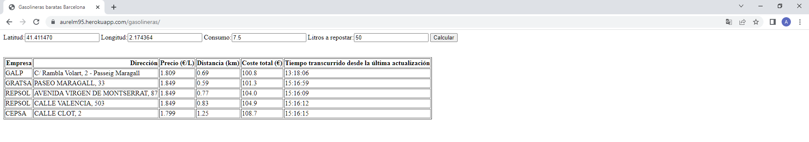

# GasolinaBarataBarcelona
Pequeño proyecto de webscrapping con python para identificar la gasolinera más conveniente en cuanto a prefio de Barcelona teniendo en cuenta:
- Consumo del vehiculo de gasolina (l/100km)
- Distancia a la gasolinera desde la ubicación actual
- Cantidad de litros a repostar
- Precio de la gasolina

# Aplicación web

Puedes usar el script a través de la web: https://aurelm95.herokuapp.com/gasolineras/

# Author
**Aurelio Losquiño** 
- email: aurelm95@gmail.com
- [Linkedin](https://es.linkedin.com/in/aurelio-losqui%C3%B1o-mu%C3%B1oz-b7284b204)